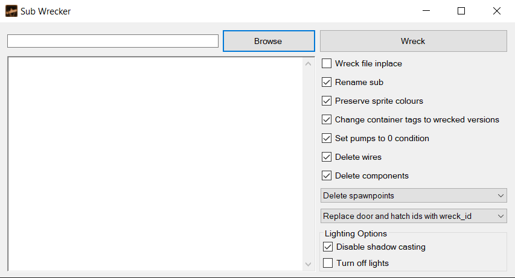

# Sub-Wrecker
Convert Barotrauma submarines to wrecks. 
## Prerequisutes
Microsoft .NET Framework 4.7.2
## Installation
1. Either build the project from source, or download a compressed executable from the latest release. The included .dll files must be within the same directory as the executable.
## Usage
Run `Sub-Wrecker.exe`.  

### Browse
Select one or more `.sub` files to wreck.
### Wreck
Clicking this button will wreck the selected files in accordance with the settings below.
#### Wreck file inplace
Instead of outputting to a new file, output to the same file as used for input.
#### Rename sub
Append `_Wrecked` to the name of the submarine
#### Preserve sprite colours
If unchecked, will reset all sprite colours of wrecked objects to `255,255,255,255`.
#### Change container tags to wrecked versions
Replaces the tags on containers with wrecked versions, e.g. `medcab` becomes `wreckmedcab`.
#### Set pumps to 0 condition
Set the `condition` attribute of pumps and smallpumps to 0, giving them a wrecked appearance.
#### Delete wires
If checked, deletes all wires on the submarine.
#### Delete components
If checked, deletes all wiring components on the submarine.
#### Spawnpoint behaviour dropdown
##### Delete spawnpoints
Delete all spawnpoints found.
##### Replace spawnpoints with corpse spawnpoints
Replace all spawnpoint types with corpse spawnpoints.
##### Leave spawnpoints alone
Do nothing to spawnpoints.
#### Door behaviour dropdown
##### Replace door and hatch ids with wreck_id
On all doors and hatches in the submarine, make them accessible with `wreck_id` as a `requireditem`.
##### Set canbepicked to False
On all doors and hatches in the submarine, set the value of `canbepicked` to `False`. This has the effect of not allowing any id card to open them.
##### Leave hatches and doors alone
Do nothing to hatches and doors.
#### Lighting options
##### Disable shadow casting
On each light found, set `CastShadows` to `False`. Improves performance of the wreck.
##### Turn off lights
On each light found, set `IsOn` to `False`, disabling the light.
